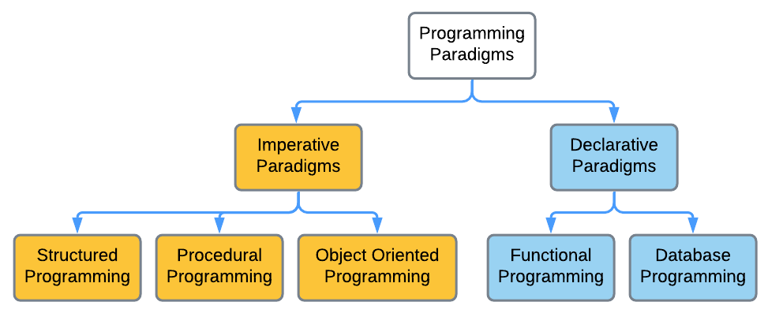
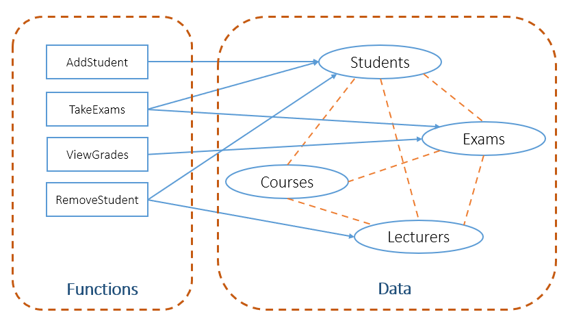

<h2 align="center"> 
GIỚI THIỆU
</h2>

## Sơ lược các phương pháp lập trình (programming paradigms)

Xem chi tiết

- Các chương trình máy tính ngày càng trở nên đa dạng và phức tạp hơn, do đó cách tiếp cận lập trình cũng cần có sự cải tiến để đáp ứng yêu cầu. 
- Có thể chia ngôn ngữ lập trình thành hai nhóm chính (gọi là *"mô thức lập trình" (programming paradigms)* - có thể hiểu là phương pháp luận hay nguyên tắc chung cơ bản trong lập trình): 
    * [**Lập trình hướng mệnh lệnh (imperative programming)**](#imperative)
    * [**Lập trình khai báo (declarative programming)**](#declarative)

 

### **Lập trình hướng mệnh lệnh (Imperative Programming)** <a name="imperative">
- Nguyên lý lập trình mệnh lệnh là *ra lệnh máy tính thực hiện từng bước xử lý theo một trình tự xác định để đạt kết quả mong muốn - (how to do)*, tương đồng với cách máy tính thực hiện ở mức mã máy (machine code). 
- Các lệnh được cài đặt theo trình tự của giải thuật, vì thế kiểu lập trình này còn gọi là lập trình giải thuật (algorithmic programming). Hầu hết ngôn ngữ lập trình đều hỗ trợ kiểu lập trình này. 
- Các phương pháp lập trình cấu trúc (structured programming), lập trình hướng thủ tục (procedural programming), lập trình hướng đối tượng (object-oriented programming) đều thuộc mô thức lập trình hướng mệnh lệnh.

#### Lập trình cấu trúc (structured programming)
- Là phương pháp lập trình dựa trên cách tiếp cận từ trên xuống (top-down development), từ tổng quát đến chi tiết. Theo đó, chương trình được chia thành các khối chức năng, các chức năng này nếu cần lại được phân chia tiếp thành các khối chức năng nhỏ hơn, cho đến khi các chức năng nhỏ nhất đủ đơn giản để cài đặt thành các chương trình con (thủ tục/hàm).
- Chương trình là sự kết hợp của các cấu trúc điều khiển: tuần tự (sequence), chọn lựa (selection) và lặp (repetition).

#### Lập trình hướng thủ tục(procedural programming)
Lập trình hướng thủ tục là sự cải tiến của lập trình cấu trúc, với các mở rộng sau:
-  Mỗi chức năng ở từng lớp được tổ chức thành chương trình con.
- Chương trình con nhận dữ liệu vào thông qua truyền đối số, xử lý và trả về kết quả.
- Chương trình có tính module hóa cao.
- Dữ liệu và xử lý tách rời nhau.

### **Lập trình khai báo (Declarative Programming)** <a name="declarative">

Các ngôn ngữ lập trình khai báo diễn đạt các câu lệnh theo cách *yêu cầu máy tính phải làm gì (what to do)* để đạt được kết quả mà không cần quan tâm đến cách thức thực hiện chi tiết. Các phân hệ của lập trình khai báo gồm có: Lập trình logic (như Prolog), hướng chức năng (như Haskell, Scala, F#), ngôn ngữ chuyên dụng (domain-specific) như SQL, HTML.
   

## Phương pháp lập trình hướng đối tượng

Xem chi tiết

### Bài toán ví dụ
Để minh họa các cách tiếp cận lập trình, ta xét bài toán - đã đơn giản hóa - sau đây:

Một trường học cần xây dựng phần mềm quản lý đào tạo. Hệ thống này quản lý dữ liệu của sinh viên (Students), giảng viên (Lecturers), các môn học (Courses), và các kỳ thi (Exams). 
Phần mềm cần có các chức năng: thêm sinh viên (AddStudent), xóa sinh viên (RemoveStudent), dự thi (TakeExams), xem điểm (ViewGrades). 

Sau khi phân tích, mô hình hệ thống quản lý đào tạo được thiết kế theo sơ đồ sau:

Hệ thống quản lý gồm có dữ liệu (data) và các chức năng (functions) thao tác trên dữ liệu. Trong đó, đường nét đứt thể hiện sự phụ thuộc của một tập dữ liệu vào một tập dữ liệu khác; chẳng hạn, mỗi sinh viên học nhiều môn học, mỗi môn học lại có nhiều sinh viên. Đường mũi tên thể hiện sự tác động của các chức năng lên một hoặc một số tập dữ liệu; ví dụ, chức năng thêm sinh viên (AddStudent) sẽ thay đổi nội dung của tập dữ liệu sinh viên (Students), còn chức năng dự thi (TakeExams) cần truy cập dữ liệu của cả sinh viên và kỳ thi (Exams). 

Theo cách tiếp cận lập trình hướng thủ tục/cấu trúc, mỗi chức năng được tổ chức thành một chương trình con (hàm) tương ứng. Các hàm thực hiện xử lý dữ liệu thông qua truyền tham số và trả về kết quả cho lời gọi hàm. 

Xét vài tình huống sau:
- *Tình huống 1*: Giả sử dữ liệu đang lưu trữ năm sinh là số có 2 chữ số, cần chuyển đổi thành số có 4 chữ số (ví dụ: 97 -> 1997), thì giải quyết thế nào?

Giải pháp hiển nhiên là cần thay đổi trường dữ liệu ngày sinh của sinh viên và giảng viên thành số có 4 chữ số. Khi đó, tất cả các hàm có tác động lên sinh viên và giảng viên sẽ không hoạt động được, trừ khi phải chỉnh sửa lại mã nguồn. Bên cạnh đó, tập dữ liệu sinh viên có mối quan hệ phụ thuộc với các tập dữ liệu khác, vì thế việc thay đổi này có thể gây ra lỗi cho hệ thống.

- *Tình huống 2*: Hệ thống cần quản lý thêm một thành phần dữ liệu mới là sinh viên hệ vừa làm vừa học, vậy cần giải quyết thế nào?

Với phương pháp lập trình cấu trúc, cần thiết kế lại mô hình dữ liệu để bổ sung tập dữ liệu sinh viên vừa làm vừa học, sau đó viết các hàm xử lý tương ứng với mỗi chức năng cần có với tập dữ liệu mới này. 

Các tình huống trên cho thấy nhược điểm của phương pháp lập trình cấu trúc khi giải quyết những bài toán phức tạp. Khi đó, việc bảo trì, nâng cấp hay mở rộng trở nên rất khó khăn. Đồng thời, khả năng *tái sử dụng mã nguồn* và *sự che chắn dữ liệu* cũng rất hạn chế.

### Cách tiếp cận hướng đối tượng
- Xem phần mềm là tập hợp các đối tượng tương tác với nhau.
- Mỗi đối tượng là sự đóng gói hai thành phần:
    * Thuộc tính (properties): Là các thông tin mô tả đối tượng.
    * Phương thức (methods): Là các hành vi (behaviours) mà đối tượng có thể thực hiện.
- Đối tượng = Thuộc tính + Phương thức

## Tài liệu tham khảo 

  

    Xem chi tiết

#### Lectures on High-performance Computing for Economists, University of Pennsylvania, 2020
#### Programming Languages, Stanford University, 2018
#### Object Oriented Analysis and Design using the UML
#### Giáo trình Kỹ thuật lập trình, Nguyễn Đức Thuần, Trường đại học Nha Trang, 2020

