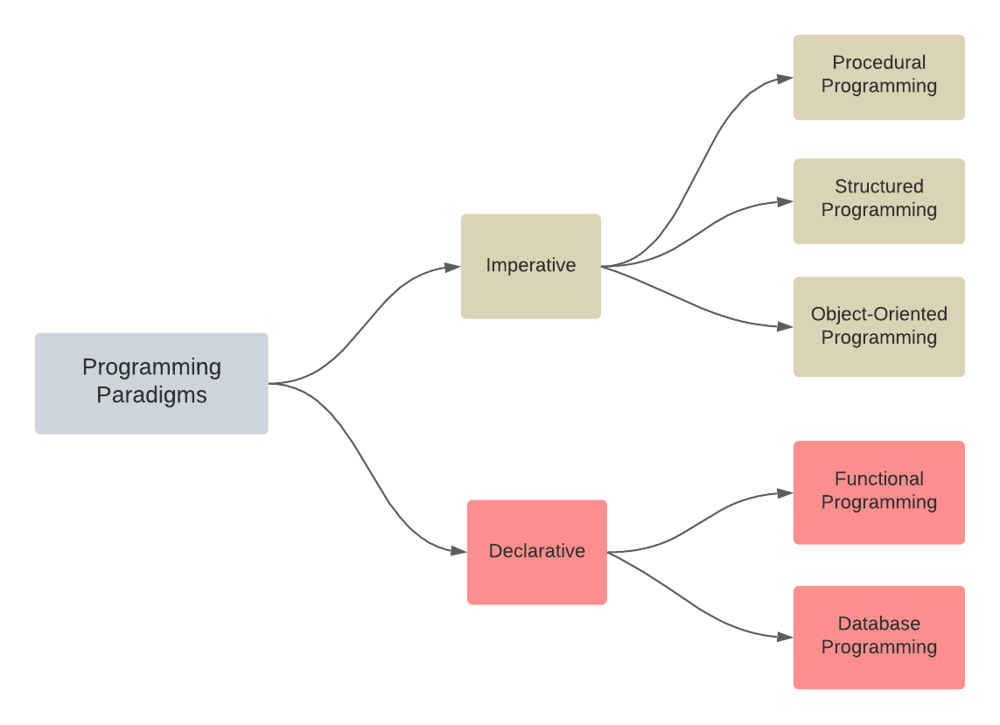

<h1 align="center"> 
TỔNG QUAN VỀ LẬP TRÌNH HƯỚNG ĐỐI TƯỢNG
</h1>

## Sơ lược về lập trình

Có thể nói, lập trình (programming) là trọng tâm của khoa học máy tính bởi đây là công cụ thực hành kết hợp trí tuệ con người với sức mạnh xử lý của máy tính điện tử để tạo ra chương trình máy tính (computer program) giúp tự động hóa xử lý thông tin. Máy tính điện tử chỉ có khả năng xử lý thông tin theo chương trình được lập sẵn. Để giải quyết một bài toán, máy tính không tự nghĩ ra cách giải mà con người cần phân tích yêu cầu của bài toán để xây dựng một dãy các chỉ thị được định nghĩa rõ ràng - gọi là thuật toán (algorithm) - rồi sử dụng một (hoặc một số) ngôn ngữ lập trình (programming language) để cài đặt thuật toán thành chương trình máy tính. 

Một chương trình tốt cần thỏa mãn các yêu cầu sau:

**Đối với người sử dụng:**
- Chính xác, hiệu quả: Chương trình giải quyết được các yêu cầu đặt ra của bài toán với thời gian ngắn, chi phí thấp.
- Ổn định, tin cậy.
- Giao diện thân thiện.

**Đối với người lập trình:**
- Mã nguồn dễ hiểu: Giúp giảm thiểu lỗi, bảo trì, nâng cấp.
- Dễ cập nhật, nâng cấp khi yêu cầu của bài toán thay đổi.
- Có khả năng tái sử dụng hoặc kế thừa cho bài toán khác.

## Các mô thức lập trình (programming paradigms)

Đến nay, có nhiều phương pháp lập trình được đề xuất, nhiều ngôn ngữ lập trình được phát triển. Dưới đây là một số cách tiếp cận chính trong lập trình (được gọi là "mô thức" - programming paradigm).

|  |
|:--:|
| Các mô thức lập trình |

#### Lập trình hướng mệnh lệnh (Imperative Programming)
Ý tưởng cơ bản của lập trình mệnh lệnh tương đồng với cách máy tính thực hiện ở mức mã máy (machine code), hầu hết ngôn ngữ lập trình đều hỗ trợ kiểu lập trình này. 
Theo cách tiếp cận này, chương trình được xem là một dãy các lệnh yêu cầu máy tính thực hiện **làm thế nào (how)** - từng bước một - cho đến khi đạt được kết quả mong muốn. Lập trình hướng thủ tục (procedural programming), hướng cấu trúc (structured programming), hướng đối tượng (object-oriented programming) đều thuộc mô thức lập trình hướng mệnh lệnh.

Lập trình hướng mệnh lệnh có các ưu điểm: mã nguồn dễ đọc, dễ hiểu, dễ triển khai. Vì thế, 

FEASIBILITY
Developers can reason a source code easily by determining what a single-core processor can do with it.

WIDELY USED
Imperative programming is being taught in schools, colleges, and workplaces by authority. Programmers and developers have a high degree of familiarity with it.
Lập trình mệnh lệnh phù hợp với các chương trình đơn giản. 

Một số ngôn ngữ phổ biến hỗ trợ lập trình mệnh lệnh: C/C++, C#, Java, PHP, Python.

## Cách tiếp cận hướng đối tượng

## Tài liệu tham khảo 
https://www.cs.mcgill.ca/~rwest/wikispeedia/wpcd/wp/i/Imperative_programming.htm

Lectures on High-performance Computing for Economists, University of Pennsylvania, 2020

https://cs.lmu.edu/~ray/notes/paradigms/

Giáo trình Kỹ thuật lập trình, Nguyễn Đức Thuần, Trường đại học Nha Trang, 2020

