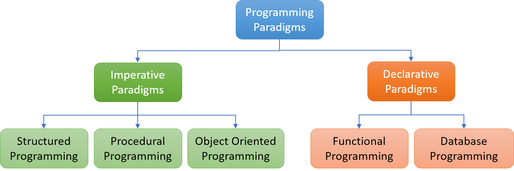
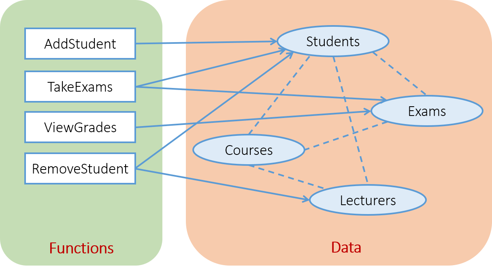

<h2 align="center"> 
Giới thiệu về lập trình hướng đối tượng
</h2>

<div class="header">
<p>
<h3>Sơ lược các phương pháp lập trình </h3>
<ul>
<li><h4>Lập trình hướng mệnh lệnh (Imperative Programming)</h4></li>
<li><h4>Lập trình khai báo (Declarative Programming)</h4></li>
</ul>
<h3>Phương pháp lập trình hướng đối tượng </h3>
<ul>
<li>
<h4>Bài toán minh họa</h4>
</li>
<li>
<h4>Cách tiếp cận hướng đối tượng</h4>
</li>
<li>
<h4>Ngôn ngữ lập trình hướng đối tượng</h4>
</li>
</ul>
</p>
</div>


## Sơ lược các phương pháp lập trình 

- Các ứng dụng ngày càng đa dạng và phức tạp hơn, do đó các ngôn ngữ lập trình cũng cần có sự cải tiến để giải quyết hiệu quả.
- Dựa theo "mô thức lập trình" (programming paradigms - phương pháp luận hay nguyên tắc chung cơ bản trong lập trình), các ngôn ngữ lập trình được chia thành hai nhóm chính: 
    * Lập trình hướng mệnh lệnh (imperative programming)
    * Lập trình khai báo (declarative programming)

 


### Lập trình hướng mệnh lệnh (Imperative Programming)

- Nguyên lý lập trình mệnh lệnh là **"how to do"** - ra lệnh máy tính thực hiện từng bước xử lý theo một trình tự xác định để đạt kết quả mong muốn, tương đồng với cách máy tính thực hiện ở mức mã máy (machine code). 
- Chương trình được cài đặt theo trình tự của giải thuật, vì thế kiểu lập trình này còn gọi là lập trình giải thuật (algorithmic programming). 
- Các phương pháp lập trình hướng thủ tục/cấu trúc (procedural/structured programming), lập trình hướng đối tượng (object-oriented programming) đều thuộc mô thức lập trình hướng mệnh lệnh.

<details>
<summary> Ví dụ </summary>
<p>

```c#
/*
Minh họa lập trình hướng mệnh lệnh với C#
Input: Dãy số nguyên
Output: Dãy số được sắp xếp tăng dần
*/

using System;

// Khởi tạo một mảng số nguyên
int n=6;
int[] numbers = new int[] {3,8,2,1,6,5};

// Sắp xếp tăng dần - giải thuật đổi chỗ trực tiếp
for(int i=0; i < n-1; i++)
    for(int j=i+1; j < n; j++)
        if(numbers[i] > numbers[j])
        {
            int t = numbers[i];
            numbers[i] = numbers[j];
            numbers[j] = t;
        }

// In ra danh sách đã sắp xếp
Console.WriteLine("Mang tang dan:");
for(int i=0; i < n; i++)
    Console.Write("{0} ", numbers[i]);    
```

</p>
</details>

<br>

#### Lập trình hướng thủ tục/cấu trúc (procedural/structured programming)
- Là phương pháp lập trình dựa trên cách tiếp cận từ trên xuống (top-down development), từ tổng quát đến chi tiết. Theo đó, chương trình được chia thành các khối chức năng, các chức năng này nếu cần lại được phân chia tiếp thành các khối chức năng nhỏ hơn, cho đến khi các chức năng nhỏ nhất đủ đơn giản để cài đặt thành các chương trình con (thủ tục/hàm).
- Chương trình là sự kết hợp của các cấu trúc điều khiển: tuần tự (sequence), chọn lựa (selection) và lặp (repetition).
- Dữ liệu và xử lý tách rời nhau.

<details>
<summary>Ví dụ</summary>

<p>

```c#
/*
Minh họa lập trình cấu trúc với C#
Input: Dãy số nguyên
Output: Dãy số được sắp xếp tăng dần
*/

// Khởi tạo một mảng số nguyên
int n=6;
int[] numbers = new int[] {3,8,2,1,6,5};

// Gọi hàm sắp xếp tăng dần
SapXepTD(numbers, n);

// Gọi hàm in mảng
InMang(numbers, n);

// Hàm sắp xếp mảng tăng dần
static void SapXepTD(int[] a, int n)
{
for(int i=0; i < n-1; i++)
    for(int j=i+1; j < n; j++)
        if(a[i] > a[j])
        {
            int t = a[i];
            a[i] = a[j];
            a[j] = t;
        }
}

// Hàm in mảng
static void InMang(int[] a, int n)
{
    for(int i=0; i < n; i++)
        Console.Write("{0} ", a[i]);
}
```

</p>
</details>
<br>

### Lập trình khai báo (Declarative Programming)

Các ngôn ngữ lập trình khai báo diễn đạt các câu lệnh theo kiểu **"what to do"** - yêu cầu máy tính làm gì để đạt được kết quả mà không cần quan tâm đến cách thức thực hiện chi tiết. Các phân hệ của lập trình khai báo gồm có: Lập trình logic (như Prolog), hướng chức năng (như Haskell, Scala, F#), các ngôn ngữ chuyên biệt (domain-specific) như SQL, HTML.

<details>
<summary>Ví dụ</summary>
<p>

```c#
/*
Minh họa lập trình khai báo với C#
Input: Dãy số nguyên
Output: Dãy số được sắp xếp tăng dần
*/

using System;
using System.Collections.Generic;

// Tạo một danh sách
List<int> numbers = new List<int> { 3, 8, 2, 1, 5, 6 };

// Gọi phương thức sắp xếp (tăng dần)
// Người lập trình không cần cài đặt hàm Sort()
numbers.Sort();

// Print the sorted list
Console.WriteLine("Day tang dan:");
Console.WriteLine("{0}", string.Join(", ", numbers));
```

</p>
</details>
<br>

<div class="info">
  <p>
  <ul>
    <li>
        Một số ngôn ngữ chỉ hỗ trợ một mô thức lập trình (single-paradigm), như Smalltalk, Haskell.
    </li>
    <li>
        Nhiều ngôn ngữ hỗ trợ đa mô thức (multi-paradigm), như: C++, Java, JavaScript, C#, PHP, Python.
    </li>
  </ul>
  </p>
</div>


## Phương pháp lập trình hướng đối tượng
### Bài toán minh họa
Để minh họa các cách tiếp cận lập trình, ta xét bài toán - đã đơn giản hóa - sau đây:

Một trường học cần xây dựng phần mềm quản lý đào tạo. Hệ thống này quản lý dữ liệu của sinh viên (Students), giảng viên (Lecturers), các môn học (Courses), và các kỳ thi (Exams). 
Phần mềm cần có các chức năng: thêm sinh viên (AddStudent), xóa sinh viên (RemoveStudent), dự thi (TakeExams), xem điểm (ViewGrades). 

Sau khi phân tích, mô hình hệ thống quản lý đào tạo được thiết kế theo sơ đồ sau:



Hệ thống quản lý gồm có dữ liệu (data) và các chức năng (functions) thao tác trên dữ liệu. Trong đó, đường nét đứt thể hiện sự phụ thuộc của một tập dữ liệu vào một tập dữ liệu khác; chẳng hạn, mỗi sinh viên học nhiều môn học, mỗi môn học lại có nhiều sinh viên. Đường mũi tên thể hiện sự tác động của các chức năng lên một hoặc một số tập dữ liệu; ví dụ, chức năng thêm sinh viên (AddStudent) sẽ thay đổi nội dung của tập dữ liệu sinh viên (Students), còn chức năng dự thi (TakeExams) cần truy cập dữ liệu của cả sinh viên và kỳ thi (Exams). 

Theo cách tiếp cận lập trình hướng thủ tục/cấu trúc, mỗi chức năng được tổ chức thành một chương trình con (hàm) tương ứng. Các hàm thực hiện xử lý dữ liệu thông qua truyền tham số và trả về kết quả cho lời gọi hàm. 

Xét vài tình huống sau:
- *Tình huống 1*: Giả sử dữ liệu đang lưu trữ năm sinh là số có 2 chữ số, nay cần chuyển đổi thành số có 4 chữ số (ví dụ: 97 -> 1997).

Giải pháp hiển nhiên là cần thay đổi trường dữ liệu ngày sinh của sinh viên và giảng viên thành số có 4 chữ số. Khi đó, tất cả các hàm có tác động lên sinh viên và giảng viên sẽ không hoạt động được, trừ khi phải chỉnh sửa lại mã nguồn. Bên cạnh đó, tập dữ liệu sinh viên có mối quan hệ phụ thuộc với các tập dữ liệu khác, vì thế việc thay đổi này có thể gây ra lỗi cho hệ thống.

- *Tình huống 2*: Hệ thống cần quản lý thêm một thành phần dữ liệu mới là sinh viên hệ vừa làm vừa học.

Với phương pháp lập trình cấu trúc, cần thiết kế lại mô hình dữ liệu để bổ sung tập dữ liệu sinh viên vừa làm vừa học, sau đó viết các hàm xử lý tương ứng với mỗi chức năng cần có với tập dữ liệu mới này. 

Các tình huống trên cho thấy nhược điểm của phương pháp lập trình cấu trúc khi giải quyết những bài toán phức tạp. Khi đó, việc nâng cấp hay mở rộng trở nên khó khăn. Đồng thời, khả năng *tái sử dụng mã nguồn* và *sự che chắn dữ liệu* cũng hạn chế.


### Cách tiếp cận hướng đối tượng (Object-oriented Approach)
- Cách tiếp cận hướng đối tượng kết hợp dữ liệu và xử lý vào một thực thể gọi là đối tượng (object).
- Chương trình là tập hợp các đối tượng tương tác với nhau.
- Mỗi đối tượng là sự đóng gói hai thành phần:
    * Thuộc tính (properties): Là các thông tin mô tả đối tượng.
    * Phương thức (methods): Là các hành vi (behaviours) mà đối tượng có thể thực hiện.

Quay lại bài toán quản lý đào tạo:
- Với cách tiếp cận hướng đối tượng, các chức năng thêm sinh viên (AddStudent), xóa sinh viên (RemoveStudent) xử lý trên tập dữ liệu sinh viên (Students). Vì thế, các phương thức xử lý này sẽ được đóng gói cùng với dữ liệu sinh viên trong một đối tượng thuộc lớp Student. Với mỗi sinh viên, lớp Student sẽ tạo ra một thực thể tương ứng để lưu trữ, quản lý dữ liệu và các xử lý liên quan. Tương tự như vậy với các chức năng và tập dữ liệu khác.


- Đối tượng có thể tương tác với đối tượng khác bằng cách gọi hàm của chúng. Chẳng hạn, khi một đối tượng sinh viên gọi chức năng "Add()",  chương trình sẽ tạo mới một đối tượng sinh viên, sau đó chức năng "AddAttendee()" sẽ được gọi từ một đối tượng của lớp môn học (Course).


## Tài liệu tham khảo 

#### Lectures on High-performance Computing for Economists, University of Pennsylvania, 2020
#### Programming Languages, Stanford University, 2018
#### Object Oriented Analysis and Design using the UML, University of Calgary, 2000


