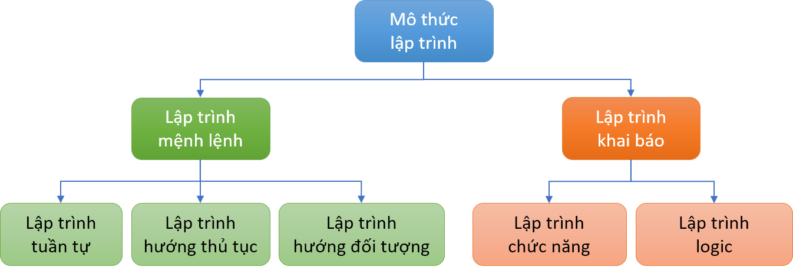
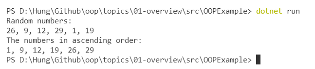

<h2 align="center"> 
Giới thiệu về lập trình hướng đối tượng
</h2>

<div class="header">
<p>
<h3><a href="#paradigms">Sơ lược các phương pháp lập trình </a></h3>
<ul>
<li><h4>Lập trình hướng mệnh lệnh (Imperative Programming)</h4></li>
<li><h4>Lập trình khai báo (Declarative Programming)</h4></li>
</ul>

<h3><a href="#oop">Phương pháp lập trình hướng đối tượng</a></h3>
<ul>
<li>
<h4>Bài toán minh họa</h4>
</li>
<li>
<h4>Cách tiếp cận hướng đối tượng</h4>
</li>
<li>
<h4>Ngôn ngữ lập trình hướng đối tượng</h4>
</li>
</ul>
</p>
</div>


<h2 id="paradigms"> Sơ lược các phương pháp lập trình</h2>


- Các ứng dụng ngày càng đa dạng và phức tạp hơn, do đó các phương pháp và công cụ lập trình cũng cần có sự cải tiến để giải quyết hiệu quả.
- Dựa theo "mô thức lập trình" (programming paradigms - phương pháp luận hay nguyên tắc chung cơ bản trong lập trình), các ngôn ngữ lập trình được chia thành hai nhóm chính: 
    * Lập trình hướng mệnh lệnh (imperative programming)
    * Lập trình khai báo (declarative programming)

 


### Lập trình hướng mệnh lệnh (Imperative Programming)

- Nguyên lý lập trình mệnh lệnh là **"how to do"** - ra lệnh máy tính thực hiện từng bước xử lý theo một trình tự xác định để đạt kết quả mong muốn, tương đồng với cách máy tính thực hiện ở mức mã máy (machine code). 
- Chương trình được cài đặt theo trình tự của giải thuật, vì thế kiểu lập trình này còn gọi là lập trình giải thuật (algorithmic programming). 
- Các phương pháp lập trình tuần tự, hướng thủ tục/cấu trúc (procedural/structured programming), lập trình hướng đối tượng (object-oriented programming) đều thuộc mô thức lập trình hướng mệnh lệnh.

#### Lập trình tuần tự
- Chương trình là một dãy tuần tự các câu lệnh.

<details>
<summary> Ví dụ </summary>
<p>

```c#
/*
Minh họa lập trình tuần tự với C#
Sắp xếp dãy số tăng dần 
Input: Dãy số nguyên
Output: Dãy số được sắp xếp tăng dần
*/

using System;

// Khởi tạo dãy số
int n=6;
int[] numbers = new int[] {3,8,2,1,6,5};

// Sắp xếp dãy tăng dần
int i=0;
OUTER_LOOP:
    int j=i+1;
    INNER_LOOP:
        if(numbers[i] > numbers[j])
            {
                int t = numbers[i];
                numbers[i] = numbers[j];
                numbers[j] = t;
            }
        j += 1;
        if(j < n) goto INNER_LOOP;
    i += 1;
    if(i < n-1) goto OUTER_LOOP;

// In ra dãy đã sắp xếp
Console.WriteLine("Day tang dan:");
i = 0;
LOOP:
    Console.Write("{0} ", numbers[i]);
    i += 1;
    if(i < n) goto LOOP;
```
</p>
</details>


#### Lập trình hướng thủ tục/cấu trúc (procedural/structured programming)
- Là phương pháp lập trình dựa trên cách tiếp cận từ trên xuống (top-down development), từ tổng quát đến chi tiết. Theo đó, chương trình được chia thành các khối chức năng, các chức năng này nếu cần lại được phân chia tiếp thành các khối chức năng nhỏ hơn, cho đến khi các chức năng nhỏ nhất đủ đơn giản để cài đặt thành các chương trình con (thủ tục/hàm).
- Chương trình là sự kết hợp của các cấu trúc điều khiển: tuần tự (sequence), chọn lựa (selection) và lặp (repetition).
- Dữ liệu và xử lý tách rời nhau.

<details>
<summary>Ví dụ</summary>

<p>

```c#
/*
Minh họa lập trình cấu trúc với C#
Input: Dãy số nguyên
Output: Dãy số được sắp xếp tăng dần
*/

// Khởi tạo một mảng số nguyên
int n=6;
int[] numbers = new int[] {3,8,2,1,6,5};

// Gọi hàm sắp xếp tăng dần
SapXepTD(numbers, n);

// Gọi hàm in mảng
InMang(numbers, n);

// Hàm sắp xếp mảng tăng dần
static void SapXepTD(int[] a, int n)
{
for(int i=0; i < n-1; i++)
    for(int j=i+1; j < n; j++)
        if(a[i] > a[j])
        {
            int t = a[i];
            a[i] = a[j];
            a[j] = t;
        }
}

// Hàm in mảng
static void InMang(int[] a, int n)
{
    for(int i=0; i < n; i++)
        Console.Write("{0} ", a[i]);
}
```

</p>
</details>


### Lập trình khai báo (Declarative Programming)

Các ngôn ngữ lập trình khai báo diễn đạt các câu lệnh theo kiểu **"what to do"** - yêu cầu máy tính làm gì để đạt được kết quả mà không cần quan tâm đến cách thức thực hiện chi tiết. Các phân hệ của lập trình khai báo gồm có: Lập trình logic (như Prolog), hướng chức năng (như Haskell, Scala, F#), các ngôn ngữ chuyên biệt (domain-specific) như SQL, HTML.

<details>
<summary>Ví dụ</summary>
<p>

```c#
/*
Minh họa lập trình khai báo với C#
Input: Dãy số nguyên
Output: Dãy số được sắp xếp tăng dần
*/

using System;
using System.Collections.Generic;

// Tạo một danh sách
List<int> numbers = new List<int> { 3, 8, 2, 1, 5, 6 };

// Gọi phương thức sắp xếp (tăng dần)
// Người lập trình không cần cài đặt hàm Sort()
numbers.Sort();

// Print the sorted list
Console.WriteLine("Day tang dan:");
Console.WriteLine("{0}", string.Join(", ", numbers));
```

</p>
</details>
<br>

<div class="info">
  <p>
  <ul>
    <li>
        Nhiều ngôn ngữ hỗ trợ đa mô thức (multi-paradigm), như: C++, Java, JavaScript, C#, PHP, Python.
    </li>
    <li>
        Một số ngôn ngữ chỉ hỗ trợ một mô thức lập trình (single-paradigm), như Smalltalk, Haskell.
    </li>
  </ul>
  </p>
</div>


<h2 id="oop"> Phương pháp lập trình hướng đối tượng </h2>

### Cách tiếp cận hướng đối tượng (Object Oriented Approach)
- Cách tiếp cận hướng đối tượng kết hợp dữ liệu và xử lý có liên quan với nhau vào một module.
- Thích hợp cho phát triển các hệ thống phức tạp và thay đổi nhanh chóng do:
    - Đáp ứng các thay đổi của hệ thống với chi phí thấp.
    - Khả năng tái sử dụng cao.
    - Tính module hóa cao, giúp đơn giản hóa việc phát triển các hệ thống lớn từ các thành phần đã có.

 - Các thành phần của hệ thống hướng đối tượng:
    - Đối tượng (objects). Một đối tượng là một thực thể được xác định bởi các thuộc tính và hành vi của nó. Các thực thể hữu hình (như sinh viên, giảng viên) hay vô hình (như tài khoản ngân hàng) đều có thể mô hình hóa dưới dạng đối tượng.
    - Thuộc tính (attributes): là các trường thông tin mô tả đối tượng.
    - Hành vi (behaviour): là cách đối tượng ứng xử với môi trường xung quanh. 
    - Lớp (class): là một nhóm các đối tượng có thuộc tính và hành vi tương tự nhau.
    - Phương thức (methods): là hành động xác định hành vi của một lớp đối tượng - là những hành động mà đối tượng có thể làm.
    - Thông điệp (message): là một phương thức tác động lên đối tượng để yêu cầu thực hiện hành động cụ thể. 

### Lập trình hướng đối tượng (Object Oriented Programming)
- Là phương pháp lập trình dựa trên cách tiếp cận hướng đối tượng.
- Chương trình là tập hợp các đối tượng. Đối tượng thực hiện các yêu cầu xử lý thông qua cơ chế truyền thông điệp (message passing). 
    * Thuộc tính: Là các thông tin mô tả đối tượng. Về mặt lập trình, việc khai báo các thuộc tính tương tự như khai báo biến, vì thế chúng còn được gọi là biến thành viên (member variables).
    * Phương thức: Là các hành vi mà đối tượng có thể thực hiện. Việc cài đặt các phương thức tương tự như các hàm, vì thế chúng còn được gọi là hàm thành viên (member functions).


<details>
<summary>Ví dụ</summary>
<p>

```c#
/*
Minh họa lập trình hướng đối tượng
Input: Mảng các số nguyên
Output: Mảng sắp xếp tăng dần
*/
using System;

// Khai báo lớp Array chứa mảng số nguyên và các xử lý trên mảng
public class Array{
    private int[] numbers; // Dữ liệu/biến thành viên

    // Phương thức (hàm) thiết lập (constructor)
    // Tạo một dãy n phần tử có giá trị ngẫu nhiên trong đoạn [Min, Max]
    public Array(int n, int min=0, int max=50)
    {
        numbers = new int[n];
        Random randNum = new Random();
        for(int i=0; i < numbers.Length; i++)
            numbers[i] = randNum.Next(min, max);
    }

    // Phương thức/Hàm thành viên
    public void Print()
    {
        Console.WriteLine("{0}", string.Join(", ", numbers));
    }

    // Sắp xếp tăng dần
    public void Sort()
    {   
        for(int i=0; i < numbers.Length - 1; i++)
            for(int j=i+1; j < numbers.Length; j++)
                if(numbers[i] > numbers[j])
                {
                    int t = numbers[i];
                    numbers[i] = numbers[j];
                    numbers[j] = t;
                }
    }
}

// Chương trình chính    
class Program
{
    static void Main(string[] args)
    {
        // Gọi phương thức thiết lập (constructor)
        // tạo mảng ngẫu nhiên các số nguyên trong khoảng [0, 30]
        Array myNumbers = new Array(6, 0, 30);
        
        // In mảng - gọi phương thức Print()
        Console.WriteLine("Random numbers:");
        myNumbers.Print();

        // Sắp xếp tăng dần - gọi phương thức Sort()
        myNumbers.Sort();

        // In mảng sau sắp xếp - gọi phương thức Print()
        Console.WriteLine("The numbers in ascending order:");
        myNumbers.Print();
    }
}
```



</p>
</details>


## Tài liệu tham khảo 

#### Lectures on High-performance Computing for Economists, University of Pennsylvania, 2020
#### Programming Languages, Stanford University, 2018
#### Object Oriented Analysis and Design using the UML, University of Calgary, 2000


